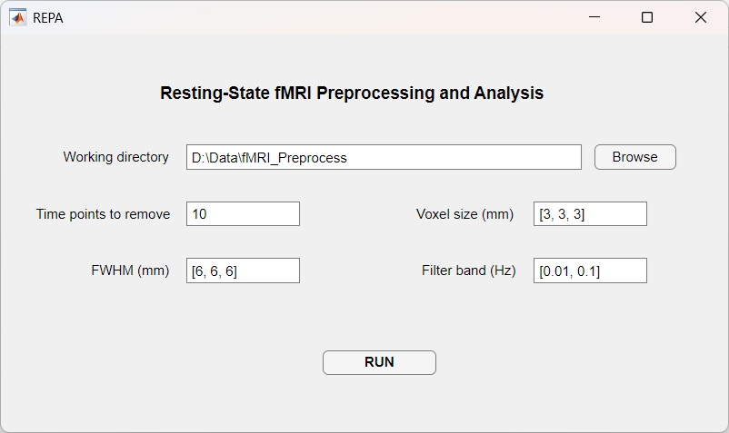

<p align="center">
  
</p>

<h1 align="center">REPA</h1>

<p align="center"><strong>Resting-State fMRI Preprocessing and Analysis</strong></p>

<p align="center">
  <a href="https://www.gnu.org/licenses/old-licenses/lgpl-2.1.en.html"></a>
</p>

REPA (Resting-state fMRI Preprocessing and Analysis) is a toolbox developed based on SPM and DPABI for processing resting-state fMRI data.

## Requirements

- MATLAB
- **Image Processing Toolbox** (recommended; used by `niftiinfo` / `nifti` for metadata and NIfTI input)
- SPM12 (pinned: `spm12`)
- DPABI V8.2 (pinned: `DPABI_V8.2_240510`)
- **dcm2niix** (bundled inside pinned DPABI at `DPARSF/dcm2nii/`; required for DICOM input)

REPA resolves dependencies in this order:

1. `REPA/third_party/` (recommended for offline use)
2. The data working directory
3. The current MATLAB working directory
4. Exact local zip names (`spm12.zip`, `DPABI_V8.2_240510.zip`)
5. Online download into `REPA/third_party/` (last resort)
6. MATLAB path, only if it already points to the pinned release

Other SPM/DPABI versions on the MATLAB path are ignored. Version mismatches are rejected.

REPA v1.36.0 is tested with **SPM12 + DPABI V8.2_240510** only.

## Default pipeline (v1.35.0+)

### Included

- Remove initial volumes, slice timing, realignment, automask, BET, T1–EPI coregistration
- SPM12 unified segmentation (`IsSegment=1`)
- MNI normalization via T1 unified-segmentation deformation fields (`IsNormalize=2`, **not DARTEL**)
- Nuisance regression (WM/CSF; optional GSR in a separate pass)
- ALFF / fALFF, band-pass filtering, ReHo, degree centrality
- Spatial smoothing on result maps after normalization (`Smooth.Timing='OnResults'`)

### Not included by default

- DARTEL registration / DARTEL-based normalization (`IsDARTEL=0`)
- Symmetric group T1 mean normalization
- VMHC

### Why unified segmentation instead of DARTEL?

v1.34.0 used SPM New Segment + **DARTEL** (`IsNormalize=3`), which requires **group-level** steps (template creation and group normalization) before all subjects can proceed. That makes true per-subject parallelism difficult and means one subject failure can block the remaining pipeline inside a single DPARSFA run.

v1.35.0 replaces DARTEL with **SPM12 unified segmentation + T1-segmentation normalization** (`IsSegment=1`, `IsNormalize=2`, `IsDARTEL=0`):

1. Each subject is segmented and normalized using its own `*_seg_sn.mat` deformation field.
2. No group DARTEL template step is required.
3. Processing is orchestrated **one subject at a time** via `repa_run.m` + `DPARSFA_serial.m` (all upstream `parfor` loops converted to serial `for`).
4. This design is **ready for outer parallelization** (e.g. multiple MATLAB workers / cluster jobs each running a different subject) because subjects no longer depend on a shared DARTEL template.

### Error handling: skip failed subjects automatically

REPA does **not** stop the whole batch when one subject fails:

- Each subject runs in its own `repa_run(i)` call.
- Errors are written to `errors/<SubjectID>_*.txt`.
- Subsequent steps (including the GSR pass) **skip subjects with existing error files**.
- Successful subjects continue through the full pipeline.

This differs from stock `DPARSFA_run.m`, where a single subject error can abort the remaining steps for all subjects in the same run.

## Installation

1. Download REPA from this repository
2. Add REPA folder to MATLAB path
3. Run `repa.m` to start the GUI

### Offline installation (recommended)

For stable, network-independent use, place the pinned dependencies under `REPA/third_party/`:

```
REPA/
├── repa.m
├── repa_utilities/
└── third_party/
    ├── spm12/
    └── DPABI_V8.2_240510/
        └── DPARSF/dcm2nii/   # dcm2niix binaries for DICOM conversion
```

You can prepare this folder automatically if SPM and DPABI are already installed elsewhere:

```matlab
cd('<REPA root>');
run('scripts/prepare_offline_bundle.m');
```

Or set source paths manually before running the script:

```matlab
spm_source = 'D:\tools\spm12';
dpabi_source = 'D:\tools\DPABI_V8.2_240510';
run('scripts/prepare_offline_bundle.m');
```

You can also download the pinned `.zip` files manually, extract them into `third_party/`, and skip online installation entirely:

- SPM12: https://www.fil.ion.ucl.ac.uk/spm/download/restricted/eldorado/spm12.zip
- DPABI: https://d.rnet.co/DPABI/DPABI_V8.2_240510.zip

For release distribution, an optional offline package (REPA + `third_party/`) can be provided separately from the lightweight source archive.



## Data Organization

REPA expects input data to be organized in a specific directory structure as shown below:

For DICOM format data, please organize your data in the following structure:

```
RootDir/
├── FunRaw/
│   ├── sub000001/
│   │   ├── 000001.dcm
│   │   ├── 000002.dcm
│   │   ├── 000003.dcm
│   │   └── ......
│   ├── sub000002/
│   │   ├── 000001.dcm
│   │   ├── 000002.dcm
│   │   ├── 000003.dcm
│   │   └── ......
│   ├── sub000003/
│   │   ├── 000001.dcm
│   │   ├── 000002.dcm
│   │   ├── 000003.dcm
│   │   └── ......
│   └── ......
└── T1Raw/
    ├── sub000001/
    │   ├── 000001.dcm
    │   ├── 000002.dcm
    │   ├── 000003.dcm
    │   └── ......
    ├── sub000002/
    │   ├── 000001.dcm
    │   ├── 000002.dcm
    │   ├── 000003.dcm
    │   └── ......
    ├── sub000003/
    │   ├── 000001.dcm
    │   ├── 000002.dcm
    │   ├── 000003.dcm
    │   └── ......
    └── ......
```

For NIFTI format data, please organize your data in the following structure:

```
RootDir/
├── FunImg/
│   ├── sub000001/
│   │   ├── sub000001_task-rest_bold.nii
│   │   └── sub000001_task-rest_bold.json
│   ├── sub000002/
│   │   ├── sub000002_task-rest_bold.nii
│   │   └── sub000002_task-rest_bold.json
│   ├── sub000003/
│   │   ├── sub000003_task-rest_bold.nii
│   │   └── sub000003_task-rest_bold.json
│   └── ......
└── T1Img/
    ├── sub000001/
    │   ├── sub000001_T1w.nii
    │   ├── sub000001_T1w_Crop_1.nii
    │   └── sub000001_T1w.json
    ├── sub000002/
    │   ├── sub000002_T1w.nii
    │   ├── sub000002_T1w_Crop_1.nii
    │   └── sub000002_T1w.json
    ├── sub000003/
    │   ├── sub000003_T1w.nii
    │   ├── sub000003_T1w_Crop_1.nii
    │   └── sub000003_T1w.json
    └── ......
```

For testing and demonstration purposes, you can download sample resting-state fMRI data in DICOM format from:
https://rfmri.org/content/demonstrational-data-resting-state-fmri

The data is already organized in the required directory structure and can be used directly with REPA after downloading and extracting.

## Usage Instructions

1. Organize your data according to the directory structure shown above
2. Open the REPA toolbox and set the following parameters in the interface:
   - `Working directory`: Set to the full path of your data root directory (RootDir)
   - `Time points to remove`: Set the number of initial time points to remove (default is 10)
   - `Voxel size (mm)`: Set the voxel dimensions in [x, y, z] format (default is [3, 3, 3])
   - `FWHM (mm)`: Set the spatial smoothing full-width at half maximum in [x, y, z] format (default is [6, 6, 6])
   - `Filter band (Hz)`: Set the temporal filtering frequency range in [low, high] format (default is [0.01, 0.1])
3. Click the `RUN` button to start processing

The GUI supports:

- **Check Dependencies** before the first run (SPM, DPABI, `niftiinfo`, bundled dcm2niix)
- **Input format** selection: auto-detect DICOM or NIfTI
- Optional **GSR pipeline pass**
- **Background processing** with live progress in the status panel

## Processing Pipeline

1. **Remove the first few time points**: The first few volumes are discarded to allow signal stabilization.

2. **Slice Timing Correction**: All functional time series are processed by slice timing correction to account for differences in slice acquisition timing.

3. **Realignment**: Motion correction is applied to realign all functional volumes and correct for head movement.

4. **Generating Automask**: Automask is generated for checking EPI coverage and creating group mask.

5. **BET**: Brain Extraction Tool (BET) is used to remove non-brain tissue from images.

6. **Coregistration**: The structural T1 image is coregistered to the mean functional image to maximize mutual information between them.

7. **Segmentation**: The coregistered structural data is segmented into gray matter, white matter and cerebrospinal fluid using unified segmentation (SPM12).

8. **Nuisance Covariates Regression**: Nuisance covariates regression removes noise including polynomial trend, head motion parameters (Friston 24-parameter model), and mean signals from white matter and CSF (global signal regression is run as a separate pass when enabled).

9. **Normalization**: The preprocessed data is normalized to MNI space using T1 unified-segmentation deformation fields (`IsNormalize=2`, no DARTEL).

10. **ALFF**: ALFF and fALFF analyses are performed to measure the amplitude of low frequency fluctuations.

11. **Filtering**: Temporal bandpass filtering is applied with frequency range 0.01-0.1 Hz.

12. **ReHo**: Regional Homogeneity (ReHo) analysis is conducted to measure local connectivity.

13. **Degree Centrality**: Degree Centrality is calculated as a measure of global connectivity.

14. **Smoothing**: Spatial smoothing is applied to derivative maps after normalization (`Smooth.Timing='OnResults'`).

## Key Features

1. **Flexible Data Input**: 
   - Supports both DICOM and NiFTI format data as input
   - Complete resting-state fMRI preprocessing pipeline with default settings
   - Comprehensive data analysis capabilities

2. **Automated Slice Timing Parameters**:
   - Automatically extracts slice timing information from JSON metadata
   - Calculates slice number, slice order, and reference slice
   - Less manual parameter input needed

3. **Data Documentation**:
   - Saves key fMRI acquisition parameters and metadata
   - Stores preprocessing configuration files for each subject
   - Maintains complete processing history

4. **Robust Processing**:
   - Serial processing to avoid errors and memory issues
   - Error logging for failed subjects with detailed diagnostics
   - Easy error tracking and debugging

5. **Enhanced User Experience**:
   - Modern App Designer GUI with dependency check, input validation, progress log, and background processing
   - Clean and organized console output
   - Real-time progress tracking
   - Estimated time remaining for each processing step
   - Clear status updates throughout pipeline execution
  
## Contact

Jing Wang (wangjing@xynu.edu.cn)
