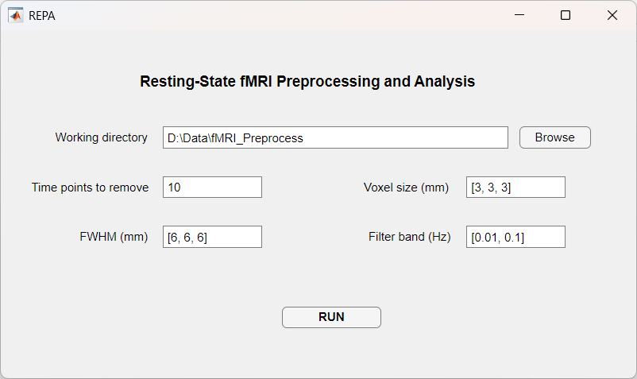

# REPA

[](https://www.gnu.org/licenses/old-licenses/lgpl-2.1.en.html)

REPA (静息态功能磁共振成像预处理与分析工具) 是一个基于 SPM 和 DPABI 开发的用于处理静息态功能磁共振数据的工具箱。

## 系统要求

- MATLAB
- SPM12
- DPABI

## 安装方法

1. 从此仓库下载 REPA
2. 将 REPA 文件夹添加到 MATLAB 路径
3. 运行 `repa.m` 启动图形界面



## 数据组织结构

REPA 要求输入数据按照以下特定目录结构组织：

对于 DICOM 格式数据，请按照以下结构组织：

```
RootDir/
├── FunRaw/
│   ├── sub000001/
│   │   ├── 000001.dcm
│   │   ├── 000002.dcm
│   │   ├── 000003.dcm
│   │   └── ......
│   ├── sub000002/
│   │   ├── 000001.dcm
│   │   ├── 000002.dcm
│   │   ├── 000003.dcm
│   │   └── ......
│   ├── sub000003/
│   │   ├── 000001.dcm
│   │   ├── 000002.dcm
│   │   ├── 000003.dcm
│   │   └── ......
│   └── ......
└── T1Raw/
    ├── sub000001/
    │   ├── 000001.dcm
    │   ├── 000002.dcm
    │   ├── 000003.dcm
    │   └── ......
    ├── sub000002/
    │   ├── 000001.dcm
    │   ├── 000002.dcm
    │   ├── 000003.dcm
    │   └── ......
    ├── sub000003/
    │   ├── 000001.dcm
    │   ├── 000002.dcm
    │   ├── 000003.dcm
    │   └── ......
    └── ......
```

对于 NIFTI 格式数据，请按照以下结构组织：

```
RootDir/
├── FunImg/
│   ├── sub000001/
│   │   ├── sub000001_task-rest_bold.nii
│   │   └── sub000001_task-rest_bold.json
│   ├── sub000002/
│   │   ├── sub000002_task-rest_bold.nii
│   │   └── sub000002_task-rest_bold.json
│   ├── sub000003/
│   │   ├── sub000003_task-rest_bold.nii
│   │   └── sub000003_task-rest_bold.json
│   └── ......
└── T1Img/
    ├── sub000001/
    │   ├── sub000001_T1w.nii
    │   ├── sub000001_T1w_Crop_1.nii
    │   └── sub000001_T1w.json
    ├── sub000002/
    │   ├── sub000002_T1w.nii
    │   ├── sub000002_T1w_Crop_1.nii
    │   └── sub000002_T1w.json
    ├── sub000003/
    │   ├── sub000003_T1w.nii
    │   ├── sub000003_T1w_Crop_1.nii
    │   └── sub000003_T1w.json
    └── ......
```

为了测试和演示目的，您可以从以下链接下载 DICOM 格式的示例静息态功能磁共振数据：
https://rfmri.org/content/demonstrational-data-resting-state-fmri

该数据已按照所需的目录结构组织，下载并解压后可直接用于 REPA。

## 使用说明

1. 按照上述目录结构组织数据
2. 打开 REPA 工具箱并在界面中设置以下参数：
   - `工作目录`：设置为数据根目录（RootDir）的完整路径
   - `删除时间点数量`：设置要删除的初始时间点数量（默认为10）
   - `体素大小(mm)`：设置体素尺寸，格式为[x, y, z]（默认为[3, 3, 3]）
   - `FWHM(mm)`：设置空间平滑的半高全宽，格式为[x, y, z]（默认为[6, 6, 6]）
   - `滤波频段(Hz)`：设置时间滤波频率范围，格式为[低, 高]（默认为[0.01, 0.1]）
3. 点击`运行`按钮开始处理

## 处理流程

1. **删除前几个时间点**：丢弃前几个体积以允许信号稳定。

2. **层间时间校正**：对所有功能时间序列进行层间时间校正，以补偿不同层面获取时间的差异。

3. **头动校正**：应用运动校正以重新对齐所有功能体积并校正头部运动。

4. **生成自动掩模**：生成自动掩模用于检查 EPI 覆盖范围并创建组掩模。

5. **脑提取**：使用脑提取工具（BET）去除图像中的非脑组织。

6. **配准**：将结构像 T1 图像配准到平均功能图像，以最大化它们之间的互信息。

7. **分割**：使用新分割方法将配准后的结构数据分割为灰质、白质和脑脊液，随后进行 DARTEL 配准。

8. **噪声协变量回归**：去除噪声，包括多项式趋势、头动参数（Friston 24参数模型）以及白质、脑脊液和全脑信号的平均值。

9. **标准化**：使用 DARTEL 变换将预处理后的数据标准化到 MNI 空间。

10. **ALFF**：进行 ALFF 和 fALFF 分析以测量低频波动的振幅。

11. **滤波**：应用时间带通滤波，频率范围为 0.01-0.1 Hz。

12. **ReHo**：进行局部一致性（ReHo）分析以测量局部连接性。

13. **度中心性**：计算度中心性作为全局连接性的度量。

14. **VMHC**：将数据标准化到对称模板以进行 VMHC（体素镜像同伦连接）分析。

15. **平滑**：对所有衍生图进行空间平滑。

## 主要特点

1. **灵活的数据输入**：
   - 支持 DICOM 和 NiFTI 格式的输入数据
   - 具有默认设置的完整静息态功能磁共振预处理流程
   - 全面的数据分析功能

2. **自动层间时间参数**：
   - 自动从 JSON 元数据中提取层间时间信息
   - 计算层数、层序和参考层
   - 减少手动参数输入需求

3. **数据文档记录**：
   - 保存关键功能磁共振采集参数和元数据
   - 为每个受试者存储预处理配置文件
   - 维护完整的处理历史记录

4. **稳健处理**：
   - 串行处理以避免错误和内存问题
   - 对失败的受试者进行错误日志记录和详细诊断
   - 便于错误追踪和调试

5. **增强用户体验**：
   - 清晰有序的控制台输出
   - 实时进度跟踪
   - 每个处理步骤的预计剩余时间
   - 整个流程执行过程中的清晰状态更新
